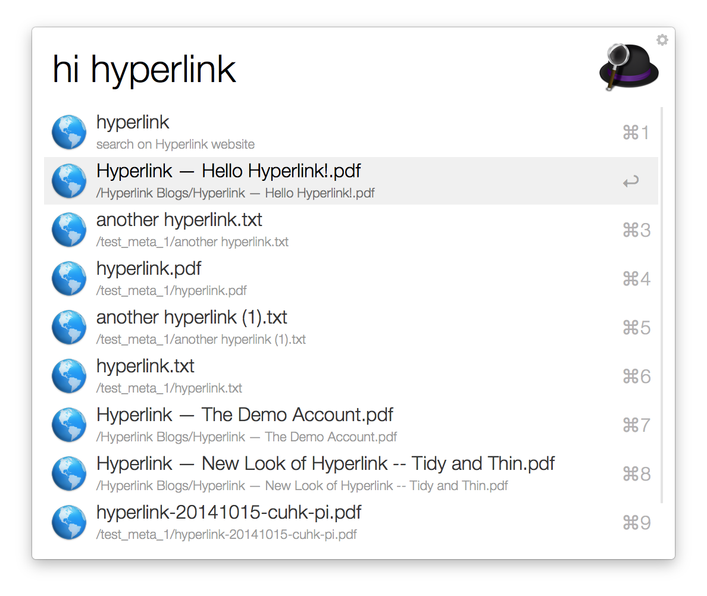

Alfred workflow for Hyperlink.

## Download
[download](https://github.com/hyperlinkapp/hyfred/raw/master/Hyperlink.alfredworkflow)

## Usage

After installation, use `hitoken <token>` to set your Hyperlink token.

Use `hi <your_query>` to search your own content connected by Hyperlink.
Select the item and press enter will redirect you to the content location, for example, your Dropbox folder.

## Screenshot

## Acknowledgement

This workflow uses the [alfred-workflow](https://github.com/deanishe/alfred-workflow) created by [Dean Jackson](https://github.com/deanishe).
